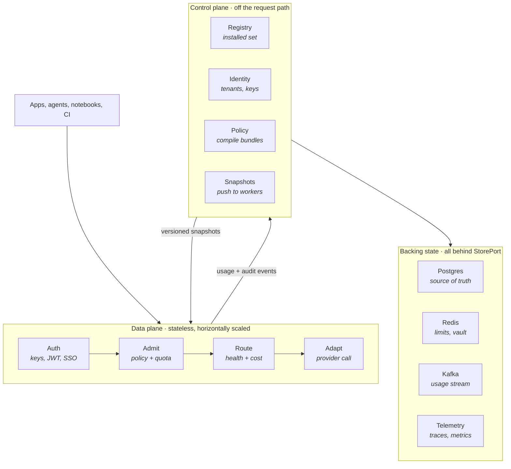
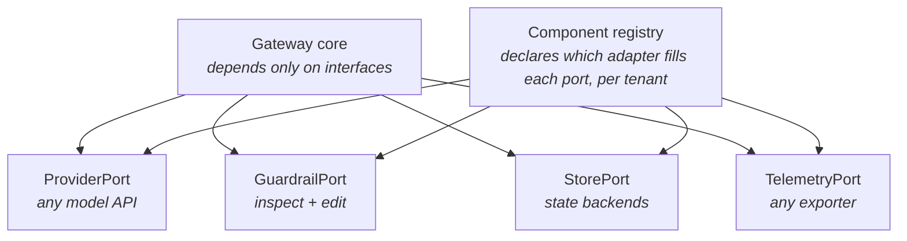
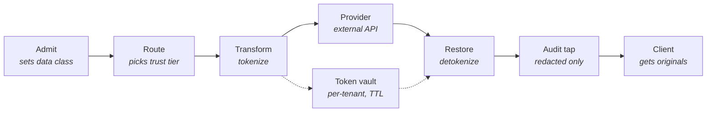
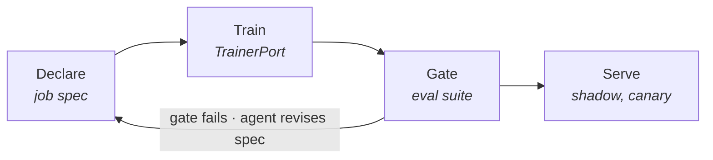

# Centralized Model Gateway — Reference Architecture

**Status:** design draft
**Scope:** a production-grade, multi-tenant AI/LLM gateway, including model fine-tuning and adapter lifecycle management (§5.7). Retrieval and knowledge-graph systems are explicitly out of scope and are built separately; the gateway's only retrieval touchpoint is routing `/embeddings` calls like any other model endpoint.
**Core constraint:** every component is replaceable through a registry. Nothing in the core names a concrete vendor, database, or provider.

---

## 1. Market landscape

Research snapshot for the build-vs-adopt decision.

| Project | Data plane | License | Health | Real strength | Real risk |
|---|---|---|---|---|---|
| **LiteLLM** | Python/FastAPI → migrating to Rust | MIT (enterprise tier gated) | ~40–46k stars, 1,300+ contributors, very active | Unmatched provider breadth — 100+ providers, day-0 model support | Security track record; SSO/RBAC/audit behind paid tier |
| **Portkey Gateway** | TypeScript (Hono), edge-deployable | Apache 2.0 | Active, ownership changed | Guardrails and PII in the OSS core | Acquired by Palo Alto Networks (May 2026), now inside Prisma AIRS |
| **Envoy AI Gateway** | Envoy (C++) + Go control plane | Apache 2.0, CNCF | v1.0 (June 2026) | K8s-native, stable control-plane API commitment, Bloomberg/Nutanix/Tetrate in production | Only sensible if you are all-in on Gateway API |
| **Bifrost** (Maxim AI) | Go, single binary | Apache 2.0 | Active, independent | Lowest measured overhead; MCP gateway in OSS | Vendor-published benchmarks; guardrails behind paid tier |
| **Apache APISIX** | NGINX/OpenResty + Lua | Apache 2.0 (ASF) | ~17k stars, 600+ contributors | AI plugin suite entirely in OSS core, no enterprise gate | Lua extension model; AI features bolted onto an API gateway |
| **Kong AI Gateway** | NGINX/OpenResty | Enterprise-gated | Mature | REST + LLM + MCP in one operating model | Advanced features Enterprise-only; 2–5 ms overhead |
| **BricksLLM** | Go | MIT | **Effectively unmaintained** | Good per-key cost/rate-limit model | Do not build on it — read it for ideas |

### Three findings that shape the design

**The field consolidated in 2026.** Portkey open-sourced its production gateway (Apache 2.0) in March 2026, then Palo Alto Networks completed its acquisition on 29 May 2026. Helicone went to Mintlify in March. BricksLLM, Glide, and RouteLLM are effectively unmaintained. The independent OSS field is now roughly LiteLLM, Bifrost, Envoy AI Gateway, and APISIX.

**LiteLLM is rewriting its hot path in Rust.** Published figures: throughput 453 → 6,782 RPS, memory 359 MB → 32 MB, per-request overhead ~7.5 ms → ~0.05 ms. Staged rollout, config/DB/API unchanged. The main technical argument against LiteLLM is being actively removed — which is why it is the right thing to adopt as a *library* rather than compete with.

**Ignore most published benchmarks.** Almost all 2026 latency figures measure proxy forwarding against a mock upstream, which deletes the largest real-world variable, and the headline microsecond numbers come from vendor-run stress tests. Gateway overhead is a rounding error next to provider TTFT. The number that matters is **how much work runs synchronously in the request path** — an architecture choice, not a language choice.

**Security is the underrated axis.** LiteLLM had a supply-chain compromise (March 2026), a critical SQLi CVE exploited within 36 hours of disclosure (April 2026), and a Host-header auth bypass fixed in v1.84.0 (June 2026). A gateway holds every provider credential in the organisation. Threat-model it as a secrets broker, not as a proxy.

---

## 2. Adopt vs build

| Component | Decision | Rationale |
|---|---|---|
| Provider translation | **Adopt** — LiteLLM Rust core as a library behind `ProviderPort` | 140 providers, day-0 model support, maintained elsewhere. Zero differentiation, infinite maintenance. |
| Data plane / HTTP core | **Build** — Go | This is the product. ~4k lines. Every alternative imposes its own control-plane model. |
| Policy evaluation | **Adopt** — Cedar (or OPA) | Formally verified, fast, well understood. Writing a policy language is a career. |
| Identity / RBAC | **Build**, thin | The org→team→user→app→key closure table and precomputed principal record are specific enough that a library fights you. |
| Rate limiting | **Build**, thin | Local token-bucket lease + Redis sliding window is ~200 lines and must be exactly right. |
| PII detection | **Adopt** — Presidio in a sidecar + custom Arabic recognisers | Presidio's structure is good; its non-English coverage is not. Extend, don't reimplement. |
| Snapshot distribution | **Build** | It is the core architectural idea. Nothing off-the-shelf does versioned-snapshot-with-N−1-tolerance. |
| Observability | **Adopt** — OTel SDK, Prometheus client | Standards. Never build. |
| Admin console | **Build** on a component library | Registry management, budgets, key issuance are your UX. |
| DB / cache / queue | **Adopt** — Postgres, Redis, Kafka | Behind `StorePort`, so the choice stays reversible. |

**The line:** adopt anything where the problem is well-defined and the maintenance is someone else's treadmill; build anything where your specific structure is the value. Provider adapters and policy languages are treadmills. The snapshot model and the identity closure are your structure.

---

## 3. Runtime layers



### Data plane
- Stateless Go workers. No local durable state, no direct Postgres access, no disk. Killable at any moment.
- Serves all four stages entirely from an in-memory snapshot. Target: **< 2 ms added overhead at p99**, excluding guardrails the tenant explicitly enabled.
- Autoscales on **concurrent-request count**, not CPU. LLM proxying is I/O-bound; CPU is a lying autoscaler signal.
- Accepts snapshot version `N` or `N−1` simultaneously — this is what makes rolling deploys and config changes safe at the same time.

### Control plane
- Owns the registry, identity graph, policy authoring, and budget definitions. Never in the request path.
- Compiles everything into an **immutable, versioned snapshot**: policy bundle + routing table + model catalog + principal records + active plugin set. Pushed over a watch stream.
- A control-plane outage degrades to *"config is frozen"*. Traffic keeps flowing. This property lets the control plane run at lower availability than the data plane.
- Consumes usage events to update budget state, then folds the result into the next snapshot. Budgets are eventually consistent by design; rate limits are not.

### Backing state
- **Postgres** — control-plane truth. Read replicas for the admin API, primary only for writes.
- **Redis** — sliding-window rate limits and the PII token vault. Both ephemeral by nature; losing Redis costs accuracy for one window, not correctness.
- **Kafka** (or Redis Streams at smaller scale) — usage/audit stream. Cost accounting, audit table, and SIEM forwarding are all consumers, so adding one never touches the gateway.
- All behind `StorePort`: Postgres→CockroachDB or Kafka→NATS is a config change, not a refactor.

---

## 4. Plug-and-play: ports and the component registry



### The four ports — the entire extension surface

| Port | Contract | Fills it |
|---|---|---|
| `ProviderPort` | `Translate(req) → upstream call → normalized stream` | OpenAI, Anthropic, Bedrock, Vertex, vLLM, Ollama, TGI, custom endpoints |
| `GuardrailPort` | `Inspect(payload, phase) → allow \| deny \| mutate` | PII detection, injection scanning, secret detection, content policy |
| `StorePort` | split into `KV`, `SQL`, `Stream` sub-interfaces | Redis, Postgres, Kafka, or anything equivalent |
| `TelemetryPort` | `Emit(event)` | OTel, Prometheus, Langfuse, SIEM forwarders, custom sinks |

> Resist adding a fifth **data-plane** port. Every new one is a compatibility surface maintained forever. If something doesn't fit these four and it sits in the request path, it probably belongs in the core.

**Control-plane ports** are a separate set with a separate discipline, because their lifecycle is asynchronous and artifact-producing rather than per-request:

| Port | Contract | Fills it |
|---|---|---|
| `TrainerPort` | `Submit(job) → poll → artifact` | **LLaMA-Factory (default)**, torchtune (custom-control escape hatch), managed provider APIs (Bedrock custom models, Vertex tuning) |
| `EvalPort` | `Run(suite, target) → scorecard` | Custom harnesses, promptfoo, DeepEval, LLM-as-judge services |

Same registry, same signed manifests, same contract-test admission gate — but these never execute inside a request, so their latency budget is measured in minutes rather than milliseconds.

### Registry mechanics
- A component is a **signed manifest**: name, semver, port implemented, config schema (JSON Schema), declared latency budget, failure mode, required capabilities.
- Registration is a control-plane API call. The manifest is validated against the port's **contract test suite** — a fixed battery every implementation of that port must pass — before activation. A plugin failing contract tests cannot enter a snapshot. This is what makes an open registry safe rather than terrifying.
- **Activation** is simply the next snapshot version. Workers load the new implementation, drain in-flight requests on the old one, unload. No restart, no redeploy.
- **Removal** is symmetric: mark inactive → next snapshot omits it → workers drain and unload. Nothing in the core knows it existed.
- **Bind per tenant, not globally.** Tenant A gets Presidio, tenant B gets regex-only, tenant C gets none. Same binary.

### Two execution modes, chosen by the manifest
- **In-process (WASM)** — for anything sub-millisecond: routing strategies, deterministic detectors, cost calculators. WASM over Go `plugin.so`: sandboxed, language-agnostic, no version-lock nightmare.
- **Out-of-process (gRPC over Unix domain socket)** — for anything heavy or non-Go: Presidio, transformer NER, Python scoring models. ~0.2 ms IPC cost, independent scaling, independent CVE surface, swappable without touching the gateway.

> **Security note.** A plugin registry is a code-execution surface. Signed manifests, WASM sandboxing for in-process components, and resource-limited sidecars for out-of-process ones are not optional extras — they are what separates this from a remote-code-execution vulnerability with a nice admin UI.

---

## 5. Component detail

### 5.1 Identity — org → team → user → application → API key
- Model as a **materialized closure table**, not recursive CTEs at request time.
- A key resolves to a precomputed **principal record** in one hash lookup: every ancestor ID, effective role set, model allowlist, budget chain, data classification defaults.
- Key format `gw_<tenant_prefix>_<random>`, stored as Argon2id hashes. The prefix carries enough routing information to shard the lookup.
- **Two-generation rotation:** a rotated key stays valid with a `deprecated` flag and a warning header until its TTL expires.
- OIDC/JWT for humans, key auth for services — both resolve to the same principal shape, so the policy engine sees exactly one type.

### 5.2 Quotas and budgets — two mechanisms, not one

**Rate limits** (RPM/TPM/concurrency) — fast, may be approximate.
- Sliding-window counter in Redis with a **local token bucket in front**. Each worker checks out a lease of N permits, decrements locally, refreshes asynchronously. No per-request Redis round-trip.
- Slight over-admission at window boundaries is acceptable and documented.

**Budgets** (daily/monthly spend, token caps) — must be correct, may lag.
- Usage events → queue → accounting consumer → Postgres → next snapshot.
- Soft quotas emit warning headers and events. Hard quotas flip a boolean the admission check reads from memory.
- **Headroom band:** hold back ~5% of a hard budget so in-flight streaming requests complete without overshoot.

**Scoping rule:** a request must satisfy *every* budget in its chain (key ∧ app ∧ user ∧ team ∧ org ∧ model). Precompute the chain into the principal record so this is an array scan over 5–6 integers.

### 5.3 Policy engine
- **Compile** policies to a decision function in the control plane; never interpret rules per request.
- Attributes: principal record + request metadata (model, endpoint, source IP, region, payload size). Allow/deny, model restrictions, and geo/IP rules are one evaluation.
- Work that genuinely needs the request path — content policy, injection detection, secret scanning — sits behind `GuardrailPort` with an explicit budget per guardrail:

```yaml
guardrails:
  - name: secret-scan
    mode: fail_closed
    blocking: true
    timeout_ms: 5
  - name: injection-heuristics
    mode: fail_open
    blocking: false      # runs off-path, can alert but not block
    timeout_ms: 50
```

Non-blocking guardrails run on a copy off-path and can only produce alerts.

> **Honest scoping:** prompt-injection protection at the gateway is largely ineffective against a determined attacker. Ship it as detection-and-logging with a stated accuracy caveat, not as a blocking control.

### 5.4 PII protection

**Placement:** hot path, blocking, on **both** legs. It is the only guardrail that cannot be moved off-path — raw data must not cross the trust boundary, and tokenisation is only useful if it is reversible on the return leg.



- **After routing, not before.** Whether to redact depends on *where the request is going*. A vLLM pod inside your VPC needs no redaction; Bedrock does. Sequence: policy stamps a data classification and computes allowed destination trust tiers → router selects within those tiers → transform is parameterised by the chosen deployment.
- **Trust tier outranks routing objectives.** A `restricted` request cannot be cost-optimised onto an external provider. If the allowed tier is empty, that is a 403, not a fallback.
- **Tiered detection** so NER cost is not paid every request:
  - *Deterministic*, in-process, microseconds — regex + checksum for card numbers (Luhn), IBAN, Emirates ID, passport, phone, email, API keys, cloud credentials. Always on for external tiers.
  - *Statistical*, out-of-process, 10–50 ms — NER for names, locations, organisations. Only when policy asks for it.
- **Sidecar, not library.** Presidio and transformer NER are Python. Behind a UDS on the same pod: ~0.2 ms IPC, independent scaling, independent CVE surface, per-language recogniser registry (English NER misses Arabic entities almost entirely).
- **Audit tap sits after redaction, never before.** Logging the raw inbound body creates a PII database with a 90-day retention policy. The vault holds `token → original` in Redis under a per-tenant encryption key, TTL = request deadline + slack, never written to any durable log.
- **Streaming restoration:** placeholders split across SSE chunks (`[[PER` + `SON_1]]`). Requires a rolling buffer on the response leg sized to the longest placeholder. This is the fiddliest part of the feature.
- **Models mangle placeholders.** If the model paraphrases or translates `[[PERSON_1]]`, restoration silently fails. Use bracketed uppercase ASCII with an underscore-digit suffix, and add a round-trip assertion per provider to the test suite.
- **Strategy is per-policy:** `redact | hash | tokenize`. Full tokenise-and-restore only earns its complexity when the response genuinely needs original values back. Classification, summarisation, and extraction should use plain redaction with no vault.

### 5.5 Router
Separate **selection** from **execution**.

- **Selection** — pick an ordered candidate list from the snapshot given: model alias, capability requirements, priority class, cost/latency objective, locality preference, allowed trust tiers.
- **Execution** — walk the list with per-deployment circuit breakers, retries with jitter, and a **deadline budget shared across attempts** so three retries cannot blow the client's timeout.
- **Health** — background prober plus passive EWMA of recent latency and error rate per deployment, both feeding a score read from memory.
- **Local-first** is a locality weight in the score. **Cloud escalation** is the fallback tier in the candidate list.
- **Model aliases** (`fast`, `reasoning`, `cheap`) decouple client code from specific model IDs. Operationally the single most useful feature in the system.

### 5.6 Observability
- OTel spans; the gateway generates the trace ID and returns it in a response header so client-side errors are correlatable.
- **Bounded metric cardinality.** Tenant ID as a Prometheus label will kill your Prometheus. Use tenant *tier* as a label; put tenant ID in exemplars and logs.
- One structured usage event per request into the stream. That stream is the source of truth for cost, audit, and SIEM forwarding.
- **Audit records are separate from usage records** — append-only table with a hash chain, different retention clock.
- Prompt and completion bodies logged only when tenant policy says so, with their own retention policy.

### 5.7 Fine-tuning and adapter lifecycle

The gateway is the right home for this because it is already the only component holding all four prerequisites: provider credentials, tenant identity, budget enforcement, and the model registry the router reads. Anywhere else means duplicating all four. From the router's perspective a fine-tuned model is just another routing target with a different lifecycle.



#### The resource

```yaml
apiVersion: gateway/v1
kind: FineTuneJob
metadata:
  name: support-triage-v3
  tenant: acme
spec:
  baseModel: llama-3.3-70b
  trainer: llamafactory-lora       # resolved via TrainerPort in the registry
  datasetRef:
    uri: s3://acme-training/triage-v3.jsonl
    checksum: sha256:1a2b...
    rows: 48210
    schemaVersion: chatml-v1
  hyperparameters:
    method: lora
    rank: 16
    epochs: 3
  budgetRef: acme/training-q3
  evalSuite: triage-regression-v2
  promotionGate:
    minScore: 0.87
    mustNotRegress: [latency_p95, refusal_rate]
  rollout:
    strategy: shadow-then-canary
    canarySteps: [1, 5, 25, 100]
status:
  phase: Evaluating                # Pending|Training|Evaluating|Shadow|Canary|Ready|Failed|Retired
  artifactRef: adapters/acme/support-triage-v3
  scorecard: { score: 0.91, latency_p95: 1.2s }
  observedGeneration: 4
```

#### Design points

**Declarative, because an agent drives it.** `spec` + `status`, reconciled by a control-plane loop. An agent POSTs a spec and polls until `status.phase == Ready`. It does not orchestrate upload → poll → commit and try to recover when step four fails — that is the shape agents get wrong. Idempotency keys on every mutation; `?dry_run=true` on everything.

**The eval gate is what makes agent-driven promotion safe.** An adapter cannot enter the routing pool until its `evalSuite` clears `promotionGate`. Because the criterion is machine-checkable rather than a judgment call, an agent can promote without a human in the loop. Changing the *gate itself* is the privileged operation and goes through propose/approve.

**Weighted rollout, not a flip.** A fine-tuned model regression is silent — no errors, just worse output. The adapter enters the routing table at weight 0, takes shadow traffic (mirrored, response discarded, scored offline), then walks the canary steps. Rollback is free: it is snapshot version `N−1`.

**Multi-LoRA serving is the economics.** Per-tenant fine-tuning is only affordable if one vLLM base-model deployment serves many adapters. The routing table carries adapter IDs; vLLM loads them dynamically. Without multi-LoRA, every tenant fine-tune is a dedicated GPU deployment and the feature does not pencil out. Design the registry so `(baseModel, adapterId)` is the routing key, not `model`.

**Datasets stay outside the gateway.** `DatasetRef` is a pointer — URI, checksum, row count, schema version. The gateway validates schema and reachability, never stores training data.

*One exception worth building:* opt-in usage-log export. The gateway is the only component holding a tenant's real completion traffic, which is the best fine-tuning corpus they have. Gate it behind explicit tenant consent, PII-scrub it on the way out, and it becomes a loop no competitor can close.

**Training spend is its own budget dimension.** A single fine-tune can exceed a month of inference. It gets its own budget in the chain, its own quota policy, and its own approval threshold — never a line item under the inference budget.

**Agents are principals, not exceptions.** The managing agent holds a service account in the same identity graph with scoped permissions (`finetune:create`, `finetune:promote`), its own training budget, and its own audit trail. It passes through the same policy engine as every other caller. An agent that must bypass policy to do its job means the gateway has no enforcement point.

**Adapter retirement is symmetric with registration.** Mark inactive → next snapshot omits it → workers drain and unload → artifact retained for the tenant's rollback window, then garbage-collected. Same mechanics as plugin removal.

#### Trainer adapters

**Decision: LLaMA-Factory is the default self-hosted trainer, with the Unsloth backend enabled.** torchtune is registered as the escape hatch for anything needing control over the training loop itself.

Rationale for a multi-tenant gateway specifically:

- **Coverage is the binding constraint.** 100+ model templates and the broadest VLM support of the three. You do not control which base model a tenant asks to tune; every unsupported model is a rejected job or a new adapter to build. Breadth maps directly onto served demand.
- **The speed penalty is ~6%.** With `use_unsloth: true`, LLaMA-Factory trains within 6% of native Unsloth speed (3.4h vs 3.2h on the reference Llama-3.1 8B / A100 40GB / QLoRA benchmark). You do not have to trade ease for throughput.
- **Headless is first-class.** `llamafactory-cli train config.yaml` drives NativeDDP and DeepSpeed directly; FSDP via `accelerate launch`; multi-node via `USE_RAY=1` with `num_workers`; DeepSpeed AutoTP for tensor parallelism alongside ZeRO. The web UI (LlamaBoard) is optional and unused here.
- Apache 2.0, no paid tier gating distributed training.

**Reconciler selection rule:**

| Condition | Adapter |
|---|---|
| `spec` names a `recipeRef` — custom loss, custom loop, novel objective | `torchtune-custom` |
| MoE / expert parallelism, context parallelism, long-context beyond FSDP | `torchtune-custom` |
| Everything else: standard SFT / LoRA / QLoRA / DPO / GRPO on a supported template | `llamafactory` (default) |
| Tenant requires a managed provider (data-residency or contractual) | `bedrock-custom` / `vertex-tuning` |

**Known ceiling on the default.** Route a job to `torchtune-custom` when it needs a custom training loop, custom hooks, modified sampling logic, or a novel objective — LLaMA-Factory's abstractions stop helping and start costing debug time. Documentation quality is inconsistent; treat the source as the reference. Init overhead is 2–3 minutes per run, which is noise on a multi-hour job but material if you batch many short ones — the reconciler should queue small jobs rather than spinning a pod per job.

**Spec → config mapping.** The adapter translates `FineTuneJob.spec` into a LLaMA-Factory YAML and runs it as a Kubernetes Job in a version-pinned image:

```yaml
model_name_or_path: {{ spec.baseModel }}
stage: sft                        # sft | dpo | kto | ppo | pt
do_train: true
finetuning_type: {{ spec.hyperparameters.method }}    # lora | qlora | full
lora_rank: {{ spec.hyperparameters.rank }}
lora_target: all
use_unsloth: true                 # backend; ~6% off native Unsloth speed
template: {{ registry.chatTemplate(spec.baseModel) }}
dataset: {{ generated dataset_info.json entry }}
dataset_dir: /mnt/dataset         # mounted from spec.datasetRef.uri
cutoff_len: 4096
num_train_epochs: {{ spec.hyperparameters.epochs }}
bf16: true
output_dir: /mnt/artifacts/{{ status.artifactRef }}
deepspeed: /configs/ds_z3.json    # injected when gpuCount > 1
report_to: none                   # telemetry flows through TelemetryPort, not W&B
```

Three implementation notes:

1. **Chat template resolution belongs in the model registry, not the trainer adapter.** LLaMA-Factory requires an explicit `template` per base model, and getting it wrong silently degrades output quality rather than erroring. Keep `baseModel → chatTemplate` as a registry field so the mapping is versioned with the model catalog.
2. **Dataset registration is generated, not authored.** LLaMA-Factory needs a `dataset_info.json` entry; the adapter synthesises it from `spec.datasetRef` (columns, formatting, schema version) at job submission. Tenants never write it.
3. **Pin the image tag.** Both LLaMA-Factory and the Unsloth backend ship frequently; a floating tag turns a reproducible job into a non-reproducible one. Pin, and treat trainer upgrades as a registry component version bump subject to the contract test suite.

Output is a LoRA adapter directory → pushed to the artifact store → registered under the `(baseModel, adapterId)` routing key for multi-LoRA serving.

#### The escape hatch: `torchtune-custom`

**Why torchtune rather than a more configurable YAML wrapper.** Axolotl and LLaMA-Factory are the same species — config layers over HF Transformers. Moving between them raises the ceiling; it does not remove it. torchtune is a different design: its stated principles are *no training frameworks* (the training logic is written out explicitly so it can be extended), *composition over implementation inheritance*, and *code duplication preferred over unnecessary abstractions*. The extension mechanism is copying a recipe file and editing the loop — that is the intended path, not a workaround.

The torchtune design paper names precisely the failure mode that pushes you off the default: in transformers-based frameworks, model construction, trainer logic, distributed policy, and adapter insertion are spread across factory layers, making fine-grained modification harder than changing the underlying PyTorch modules directly.

**Dropping down does not cost you scale here**, which is the usual trade and the reason this choice works:

- Composable parallelism stack on PyTorch DTensor — FSDP2, tensor parallel, sequence parallel, expert parallel for MoE, loss parallel, context parallel.
- The same components scale from a single H100 to multi-node FSDP2 clusters without rewriting the training loop.
- Performance is respectable, not sacrificial: 4.7h with `torch.compile` on the reference benchmark, versus Axolotl 5.8h and Unsloth 3.2h.
- Smaller transitive dependency surface than transformers-based frameworks — meaningful when containerising a trainer adapter and wanting reproducible builds.

**Cost, stated plainly.** Model coverage drops from 100+ templates to a curated set of explicit model builders. A new architecture needs a builder written or upstreamed. This is exactly why it is the escape hatch and not the default.

#### Recipes are registered components

A torchtune recipe is a Python file, so it enters the registry like any other component — signed manifest, semver, config schema, contract test suite:

```yaml
kind: TrainerRecipe
metadata:
  name: contrastive-refusal-v2
  version: 1.3.0
spec:
  port: TrainerPort
  runtime: torchtune
  entrypoint: recipes/contrastive_refusal.py
  baseModels: [llama-3.3-70b, qwen3-32b]
  parallelism: [fsdp2, context]
  contractSuite: trainer-port-v1
```

A `FineTuneJob` then points at it:

```yaml
spec:
  trainer: torchtune-custom
  recipeRef: contrastive-refusal-v2@1.3.0
```

This gives custom training logic the same governance as every other plugin — versioned, signed, contract-tested, promotable, retirable — instead of a forked trainer nobody can audit. It is the version of "full control" that does not cost you reproducibility.

**Scope limit.** This covers control *the platform team* exercises. Letting tenants upload arbitrary training code is a sandboxed code-execution problem, not a framework choice, and is out of scope for this design.

---

## 6. Scale, HA, and failure modes

### Targets
| Metric | Target |
|---|---|
| Throughput | 10k RPS per worker pod |
| Gateway overhead (p99) | < 2 ms, deterministic guardrails only |
| Snapshot propagation | < 30 s ceiling |
| Usage event loss | Zero — at-least-once with idempotent consumers |

### Failure modes — each with defined behaviour
| Failure | Behaviour |
|---|---|
| Control plane down | Config frozen; traffic flows normally |
| Redis down | Rate limits **fail open** with alarm; PII tokenisation **fails closed** |
| Postgres down | Admin API 503; data plane unaffected |
| Kafka down | Workers buffer to a bounded local ring, drop oldest with a counter, alarm |
| Provider down | Circuit breaker opens; router falls to next candidate in tier |
| Trainer backend down | Job stays `Pending`; reconciler retries with backoff; no impact on inference |
| Adapter fails eval gate | Job → `Failed`, never enters routing table; weight stays 0 |
| Adapter regresses in canary | Automatic halt at current step, alarm, revert to snapshot `N−1` |

### Multi-region
- Control plane per region reading a global Postgres; regional Redis.
- **Do not attempt globally consistent rate limiting.** Divide budgets per region, reconcile hourly.
- Data residency is a routing constraint expressed as a trust tier, not a deployment afterthought.

### Security posture
- The gateway holds every provider credential in the organisation. Threat-model it as a secrets broker.
- Envelope encryption with a KMS / Key Vault master key.
- Provider credentials **never in the snapshot** — workers fetch by reference at startup.
- Admin API on a separate listener with mTLS.
- Dedicated adversarial test suite for the auth surface.

### Testing
- **Contract suites per port** — these double as the plugin admission gate.
- Integration tests against recorded provider fixtures, so upstream provider changes surface as test failures.
- Load harness **checked into the repo** so benchmark numbers are reproducible — the thing almost every vendor in this market fails to do.
- Unit tests for policy compilation and budget arithmetic specifically; these are where correctness bugs hide.

---

## 7. Build order

| Phase | Duration | Deliverable |
|---|---|---|
| **1 — Vertical slice** | Weeks 1–4 | OpenAI-compatible `/chat/completions` + `/messages`, key auth, 4 providers via `ProviderPort`, streaming, Postgres schema, usage events to queue. Proves the snapshot model. |
| **2 — Governance** | Weeks 5–8 | Identity hierarchy, virtual keys, rate limits, budgets, accounting consumer, admin API. The first thing anyone pays for. |
| **3 — Policy & routing** | Weeks 9–12 | Cedar policy engine, `GuardrailPort`, router with health and circuit breakers, model aliases. |
| **4 — Registry & extensions** | Weeks 13–16 | Component registry, manifest schema, contract test harness, WASM runtime, sidecar protocol. |
| **5 — Fine-tuning** | Weeks 17–22 | `TrainerPort` + `EvalPort`, `FineTuneJob` reconciler, artifact registry, eval gate, weighted rollout, multi-LoRA routing key, MCP/OpenAPI surface for agent operation. |
| **6 — Enterprise** | Weeks 23+ | PII chain with Arabic recognisers, multi-region, Helm/HA hardening, admin console. |

Fine-tuning lands after the registry deliberately: `TrainerPort` and `EvalPort` reuse the manifest schema, contract-test harness, and sidecar protocol built in phase 4. Building it earlier means building that machinery twice.

Phase 4 could arguably come earlier. The argument for keeping it fourth: you cannot design good port interfaces until you have written three concrete implementations of each and learned where they leak. Ship the ports as internal interfaces in phases 1–3, then externalise them once they have stopped changing.

---

## 8. Open decisions

- **Data plane language.** Go is the recommendation (goroutine model, deployment simplicity, WASM host maturity). Rust is defensible if the team has depth; it is the wrong choice if it slows iteration in phases 1–3.
- **Cedar vs OPA.** Cedar is faster and formally verified; OPA has a larger ecosystem and Rego is more expressive. Pick Cedar unless you need Rego's data-document model.
- **WASM runtime.** Wazero (pure Go, no CGO) vs Wasmtime bindings (faster, CGO dependency). Wazero for operational simplicity unless plugin CPU cost proves material.
- **Kafka vs NATS JetStream.** Kafka if you already run it; NATS if this is a greenfield deployment and the operational surface matters more than ecosystem breadth.
- **Training execution: managed vs self-hosted.** *Settled* — self-hosted LLaMA-Factory is the default with `torchtune-custom` as the escape hatch (§5.7). Managed provider adapters remain registered for tenants with data-residency or contractual requirements, but they give no adapter portability and no multi-LoRA economics, so they are the exception. Note that OpenAI is winding down self-serve fine-tuning: after 7 May 2026 new organisations cannot create fine-tuning jobs, and active existing customers can create new jobs only until 6 January 2027, with existing fine-tuned models running until their base models are deprecated. Do not build `openai-ft` as a load-bearing adapter. The open part is whether the GPU pool runs in-cluster or bursts to a rented pool — a cost question, not an architecture one. The multi-LoRA routing key `(baseModel, adapterId)` must be in the registry schema from day one either way; retrofitting it is a migration.
- **Who owns the eval suites.** Gateway-provided defaults are safe but generic; tenant-authored suites are useful but become a code-execution surface of their own. Likely answer: suites are registered components behind `EvalPort`, subject to the same signing and sandboxing as any other plugin.
